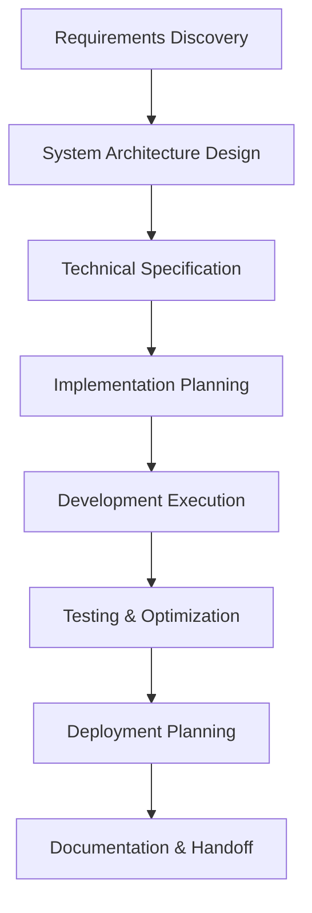

# System Design Action Guide: 90-Day Implementation Plan
*Practical steps to implement system design positioning and command premium freelance rates*

**Date:** December 6, 2025
**Based on:** System Design Thesis and Market Research
**Goal:** Position as system design specialist earning $150-500/hour

---

## QUICK START: IMMEDIATE ACTIONS (First 7 Days)

### Day 1-2: Foundation Setup
✅ **Read Key Sections of Alex Xu's Book**
   - Focus: Chapter 1 (System Design Interview), Chapter 2 (Designing a URL Shortener)
   - Action: Understand design patterns and trade-off analysis

✅ **Create System Design Portfolio Structure**
   - Folder: `/system-design-portfolio/`
   - Sub-folders: `/architecture-diagrams/`, `/case-studies/`, `/design-decisions/`

✅ **Update Professional Profiles**
   - LinkedIn: Add "System Architecture" and "Scalability Design" skills
   - Upwork: Revise title to include "System Design" or "Architecture"
   - Portfolio: Add system design section

### Day 3-5: Market Analysis
✅ **Analyze 10 Upwork System Design Postings**
   - Search terms: "system architecture," "scalability," "high traffic"
   - Document: Rate ranges, requirements, client types
   - Pattern: Identify common system design challenges

✅ **Competitive Analysis**
   - Find 5 freelancers positioning as system design experts
   - Analyze: Their portfolios, rates, client testimonials
   - Identify: Gaps you can fill

### Day 6-7: Skill Assessment
✅ **System Design Self-Assessment**
   ```markdown
   - [ ] Can design URL shortener architecture
   - [ ] Understand CAP theorem trade-offs
   - [ ] Can explain load balancing strategies
   - [ ] Know caching patterns (CDN, Redis)
   - [ ] Understand database scaling (sharding, replicas)
   - [ ] Can design API gateways and microservices
   - [ ] Know security best practices
   ```

✅ **Technology Stack Evaluation**
   - Current skills vs. system design requirements
   - Gap analysis and learning plan
   - Timeline: 3-month skill development roadmap

---

## WEEK 1-2: SYSTEM DESIGN FUNDAMENTALS

### Week 1: Core Concepts

#### **Daily Learning Schedule (2-3 hours/day):**
- **Monday**: Design a URL Shortener (Alex Xu Chapter 2)
- **Tuesday**: Design a Pastebin-like Service
- **Wednesday**: Design a Web Crawler
- **Thursday**: Design Facebook News Feed
- **Friday**: Design a TinyURL Service (deeper dive)
- **Saturday**: Practice explaining trade-offs
- **Sunday**: Review and document design decisions

#### **Tools to Master:**
1. **Diagrams**: Lucidchart or Mermaid syntax
2. **Documentation**: Markdown with architectural diagrams
3. **API Design**: OpenAPI/Swagger specification
4. **Database Design**: Draw.io for schema diagrams

#### **Practice Projects:**
```bash
# Create system design examples
mkdir system-design-examples
cd system-design-examples

# Project 1: URL Shortener
mkdir url-shortener
cd url-shortener
# Create: README.md, architecture.md, api-design.md, database-schema.md

# Project 2: Chat System
mkdir chat-system
cd chat-system
# Create: scaling-strategy.md, real-time-design.md, reliability-plan.md
```

### Week 2: Advanced Patterns

#### **System Design Patterns to Master:**
1. **Load Balancing**
   - Round-robin vs. least connections
   - Session persistence challenges
   - Health check mechanisms

2. **Caching Strategies**
   - CDN caching
   - Database query caching
   - Application-level caching
   - Cache invalidation patterns

3. **Database Scaling**
   - Read replicas
   - Database sharding
   - Connection pooling
   - Indexing strategies

4. **API Design Patterns**
   - REST vs. GraphQL trade-offs
   - API versioning strategies
   - Rate limiting approaches
   - Authentication patterns

#### **Practice Exercise:**
```
Design a system that handles:
- 1 million daily active users
- 100K requests per second peak
- 99.9% uptime requirement
- Global user base
- Real-time features
```

Document your design with:
- System architecture diagram
- Data flow diagram
- API specifications
- Database schema
- Scaling strategy
- Failure scenarios and handling

---

## WEEK 3-4: PORTFOLIO DEVELOPMENT

### Week 3: Create System Design Portfolio

#### **Portfolio Project 1: E-commerce Platform**
```markdown
# E-commerce System Design

## Business Requirements
- 100K products
- 1M monthly users
- Peak traffic: 10K concurrent users
- Real-time inventory management
- Payment processing

## System Architecture
```

**Include:**
- Microservices architecture diagram
- API gateway design
- Database design (products, orders, users)
- Caching strategy
- Search architecture (Elasticsearch)
- Payment system integration
- Scaling plan for Black Friday

#### **Portfolio Project 2: Real-time Chat System**
```markdown
# Real-time Chat System Design

## Requirements
- 1M concurrent users
- Sub-second message delivery
- Message history
- File sharing
- Group chats
```

**Include:**
- WebSocket architecture
- Load balancing for real-time connections
- Message persistence strategy
- Scalability for connection management
- Reliability and failover

### Week 4: Documentation and Presentation

#### **Create Professional Documentation Template:**
```markdown
# [System Name] Architecture Design

## 1. Business Problem & Requirements
### Functional Requirements
### Non-functional Requirements
### Constraints

## 2. System Architecture Overview
### High-level Architecture Diagram
### Component Breakdown
### Data Flow Diagram

## 3. Design Decisions & Trade-offs
### Technology Choices
### Architectural Decisions
### Trade-off Analysis

## 4. Scalability Strategy
### Horizontal Scaling Plan
### Database Scaling
### Caching Strategy
### Load Balancing

## 5. Performance Considerations
### Latency Optimization
### Throughput Planning
### Bottleneck Analysis

## 6. Reliability & Availability
### High Availability Design
### Failure Scenarios
### Disaster Recovery
### Monitoring Strategy

## 7. Security Architecture
### Authentication & Authorization
### Data Protection
### Network Security

## 8. API Design
### REST API Specifications
### Data Models
### Error Handling

## 9. Deployment Architecture
### Container Strategy
### CI/CD Pipeline
### Infrastructure as Code

## 10. Business Impact
### Cost Analysis
### ROI Calculation
### Risk Mitigation
```

#### **Video Content Creation:**
- 5-minute system design explanation
- Whiteboard session explaining trade-offs
- Architecture diagram walkthrough
- Performance optimization examples

---

## WEEK 5-6: PLATFORM OPTIMIZATION

### Week 5: Premium Platform Applications

#### **Toptal Application Strategy:**
1. **Technical Assessment Preparation**
   - Practice system design problems daily
   - Focus on explaining trade-offs clearly
   - Prepare for live coding + architecture design

2. **Portfolio Enhancement**
   - Add architectural diagrams to existing projects
   - Create case studies with business impact
   - Include performance metrics and optimizations

3. **Application Process**
   - Submit with system design focus
   - Highlight architecture experience
   - Emphasize scalability and reliability achievements

#### **Upwork Profile Optimization:**
```
Title: "System Architect | Scalability Expert | High-Performance Systems"

Specialized Profile:
- System Architecture & Design
- Scalability & Performance Optimization
- Microservices Architecture
- API Design & Integration
- Cloud Architecture

Overview:
"I design systems that scale from startup to enterprise.
Specializing in architectures that handle millions of users,
not just hundreds. From concept to deployment, I ensure
your system can grow with your business."
```

### Week 6: Content Marketing Strategy

#### **System Design Blog Posts:**
1. "5 Architecture Mistakes That Cost Startups Millions"
2. "CAP Theorem Explained for Business Leaders"
3. "When to Scale: The Architecture Decision Framework"
4. "Microservices vs. Monolith: A Practical Guide"
5. "Performance Optimization: From 100ms to 10ms"

#### **LinkedIn Content Strategy:**
- Daily system design tips
- Architecture diagram showcases
- Case study highlights
- Industry trend analysis
- Client success stories

#### **GitHub Contributions:**
- Open source system design tools
- Architecture templates
- Design pattern libraries
- Performance optimization examples

---

## WEEK 7-8: RATE OPTIMIZATION AND POSITIONING

### Week 7: Pricing Strategy Development

#### **Service Package Development:**

**1. System Architecture Audit**
```
Price: $3,000-5,000
Duration: 1-2 weeks
Deliverables:
- Architecture assessment report
- Improvement recommendations
- Risk analysis
- Implementation roadmap
```

**2. Scalability Planning**
```
Price: $5,000-10,000
Duration: 2-4 weeks
Deliverables:
- Scalability architecture design
- Performance benchmarks
- Capacity planning
- Implementation strategy
```

**3. Performance Optimization**
```
Price: $4,000-8,000
Duration: 2-3 weeks
Deliverables:
- Performance analysis
- Optimization implementation
- Monitoring setup
- Results report
```

#### **Hourly Rate Strategy:**
```markdown
# Rate Justification Framework

Base Rate (Senior Developer): $120/hr
+ System Design Expertise: +$80/hr
+ Architecture Documentation: +$50/hr
+ Business Impact Focus: +$50/hr
+ Scalability Planning: +$60/hr
= Premium Rate: $360/hr
```

### Week 8: Client Acquisition Strategy

#### **Direct Outreach Template:**
```
Subject: System Architecture Review for [Company Name]

Hi [Name],

I noticed [specific observation about their system/business challenge].

As a system architecture specialist, I help companies like yours:
- Design systems that scale 10x without rewrites
- Reduce infrastructure costs by 30-40% through optimization
- Improve reliability from 99% to 99.9% uptime
- Prepare systems for enterprise-level growth

Would you be open to a 30-minute architecture consultation?
I can provide immediate insights into your current system's
scalability and performance opportunities.

Best regards,
[Your Name]
System Architecture Specialist
Portfolio: [link]
```

#### **Platform-Specific Proposals:**

**Upwork System Design Proposal Template:**
```markdown
# System Architecture Proposal for [Project]

## Understanding Your Needs
[Client's challenge] requires careful system architecture to ensure:
- Scalability for [expected growth]
- Reliability for [business requirements]
- Performance for [user expectations]

## My System Design Approach
1. **Requirements Analysis**: Deep dive into business and technical requirements
2. **Architecture Design**: Create scalable, maintainable system architecture
3. **Documentation**: Comprehensive documentation for long-term maintainability
4. **Implementation**: Execute with best practices and testing
5. **Optimization**: Continuously monitor and optimize for performance

## Why Choose My System Design Expertise
- [X] years designing systems that scale
- Proven track record of [specific achievement]
- Focus on business outcomes, not just code
- Comprehensive documentation for team handoff

## Investment
System Design Rate: $[rate]/hour
Estimated Duration: [timeframe]
Total Investment: $[total]

This investment includes:
✅ Complete system architecture design
✅ Scalability planning for [timeframe] growth
✅ Performance optimization strategy
✅ Comprehensive documentation
✅ Implementation support
```

---

## WEEK 9-12: SCALING AND OPTIMIZATION

### Week 9-10: Client Project Execution

#### **System Design Project Workflow:**


#### **Quality Standards:**
1. **Documentation Quality**
   - Architecture diagrams with explanations
   - API documentation with examples
   - Database schema with relationships
   - Deployment procedures with rollback plans

2. **Performance Standards**
   - Load testing results
   - Performance benchmarks
   - Optimization recommendations
   - Monitoring setup

3. **Client Communication**
   - Weekly progress reports
   - Architecture decision explanations
   - Trade-off analysis with business impact
   - Risk assessment and mitigation

### Week 11-12: Advanced Positioning

#### **Thought Leadership Development:**
1. **Webinar Series**
   - "System Design for Startups"
   - "Scaling Architecture for Growth"
   - "Performance Optimization Masterclass"

2. **White Papers**
   - "The Cost of Poor Architecture"
   - "Scalability Planning Framework"
   - "Modern System Design Patterns"

3. **Speaking Opportunities**
   - Tech conferences (virtual)
   - Meetup presentations
   - Podcast interviews

#### **Premium Client Acquisition:**
1. **Enterprise Outreach**
   - Target Fortune 500 companies
   - Focus on digital transformation projects
   - Offer system architecture consulting

2. **Startup Accelerator Partnerships**
   - Partner with VCs and accelerators
   - Offer architecture due diligence
   - Provide system design workshops

3. **Agency Partnerships**
   - Collaborate with digital agencies
   - Provide system architecture expertise
   - White-label architecture services

---

## SUCCESS METRICS AND KPIs

### Monthly KPI Tracking:
```markdown
## Financial Metrics
- [ ] Average Hourly Rate: Target $250-400/hr
- [ ] Monthly Revenue: Target $15,000-25,000
- [ ] Project Profit Margin: Target 70-80%
- [ ] Client Acquisition Cost: Target <$500

### Business Metrics
- [ ] New Clients per Month: Target 2-4
- [ ] Client Retention Rate: Target 80%
- [ ] Project Completion Rate: Target 95%
- [ ] Average Project Duration: 6-12 weeks

### Marketing Metrics
- [ ] LinkedIn Engagement: Target 500+ views per post
- [ ] Portfolio Views: Target 1000+ per month
- [ ] Consultation Bookings: Target 10+ per month
- [ ] Conversion Rate: Target 20-30%

### Skill Development
- [ ] System Design Problems Completed: 5+ per week
- [ ] New Architecture Patterns Learned: 2+ per month
- [ ] Client Case Studies Published: 1+ per month
```

### Quality Metrics:
- Client satisfaction score: Target 4.8/5
- System performance improvements: Target 30-50%
- Documentation completeness: 100% for all projects
- Reference generation: 80% of projects

---

## TOOLS AND RESOURCES

### Essential Tools:
1. **Architecture Diagrams**
   - Lucidchart (paid, professional)
   - Draw.io (free, web-based)
   - Mermaid (markdown-based)

2. **Documentation**
   - Notion (knowledge base)
   - GitHub (code + documentation)
   - Markdown editors

3. **Communication**
   - Zoom (video conferencing)
   - Slack (client communication)
   - Loom (screen recordings)

4. **Performance Testing**
   - Apache JMeter (load testing)
   - Postman (API testing)
   - Google Lighthouse (web performance)

### Learning Resources:
1. **Books**
   - Alex Xu: "System Design Interview" (Vols 1 & 2)
   - Martin Fowler: "Patterns of Enterprise Application Architecture"
   - Sam Newman: "Building Microservices"

2. **Online Courses**
   - Grokking the System Design Interview
   - Scalability & System Design fundamentals
   - Cloud Architecture (AWS/Azure/GCP)

3. **Practice Platforms**
   - System Design Interview (website)
   - Interview Cake (system design section)
   - LeetCode (system design tag)

### Community:
1. **Reddit**: r/sysdesign, r/softwarearchitecture
2. **Discord**: System Design communities
3. **Meetup**: System design and architecture groups
4. **LinkedIn**: Follow system design experts

---

## CONTINUOUS IMPROVEMENT PLAN

### Weekly Review (30 minutes):
- [ ] System design practice completed
- [ ] Portfolio updated with new learnings
- [ ] Client feedback incorporated
- [ ] Marketing content published
- [ ] Skills development progress

### Monthly Review (2 hours):
- [ ] Financial goals review
- [ ] Client satisfaction assessment
- [ ] Competitive analysis update
- [ ] Learning plan adjustment
- [ ] Strategy refinement

### Quarterly Strategy Review (4 hours):
- [ ] Market trend analysis
- [ ] Service offering updates
- [ ] Pricing strategy review
- [ ] Technology stack evaluation
- [ ] Long-term goal progress

---

## TROUBLESHOOTING COMMON CHALLENGES

### Challenge 1: Difficulty Getting First System Design Client
**Solution:**
- Offer discounted architecture audit as entry point
- Create case studies from previous projects (retroactive)
- Partner with agencies for system design overflow work
- Publish system design content to demonstrate expertise

### Challenge 2: Justifying Premium Rates
**Solution:**
- Focus on ROI and business impact
- Use case studies with specific metrics
- Offer money-back guarantee on performance improvements
- Compare cost of poor architecture vs. your fees

### Challenge 3: Explaining Complex Concepts to Non-Technical Clients
**Solution:**
- Use analogies and real-world examples
- Create visual diagrams and flowcharts
- Focus on business outcomes, not technical details
- Develop standard explanation templates

### Challenge 4: Balancing Learning with Client Work
**Solution:**
- Schedule learning time like client meetings
- Apply new concepts directly to client projects
- Document learning for future reference
- Join mastermind groups for shared learning

---

## FINAL SUCCESS CRITERIA

### 90-Day Success Indicators:
✅ **Financial**: Achieving $200-300/hr average rate
✅ **Portfolio**: 3-5 comprehensive system design case studies
✅ **Clients**: 2-3 long-term system design clients
✅ **Recognition**: Viewed as system design expert in niche

### Long-term Success Vision:
🎯 **Rate Range**: $300-500/hr for system design consulting
🎯 **Client Portfolio**: Mix of startups and enterprises
🎯 **Market Position**: Recognized system design thought leader
🎯 **Business Model**: 70% consulting, 30% passive income (courses, templates)

**By following this 90-day action plan, you'll establish yourself as a system design specialist and command premium rates in the freelance market. The key is consistent practice, excellent documentation, and focus on business impact rather than just technical implementation.**